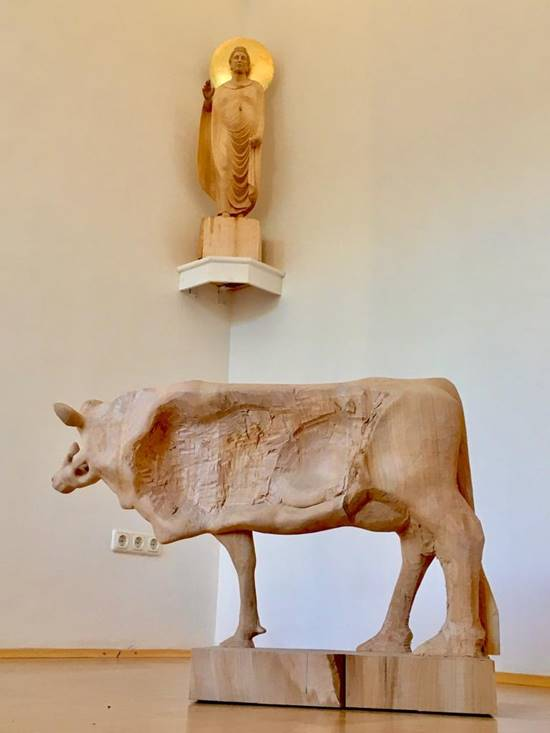

Mein Bildhauer-Freund Shigeyuki Miyagawa stellt gerade in der Münchner Georgenstraße einige Werke aus. Darunter befindet sich die Figur eines stehenden Buddhas, der mit einem Faltenwurf-Gewand gestaltet ist. Dazu hat er mir erzählt, dass es hellenistische Einflüsse auf die plastische Kunst im buddhistischen Kulturraum Asiens gab. Zusammen mit der Geste der rechten Hand und der Gloriole um das Haupt des Budhha assoziiere ich bei dieser Figur auch den segnenden oder lehrenden Christus. Mir scheint als würden in der Gestalt, die Shige schuf, die beiden großen Stifterpersönlichkeiten des Buddhismus und des Christentums verschmelzen. Für mich ist es ein Werk der interreligiösen Ökumene. Im vollkommenen Menschen ist das All-Eins-Sein präsent.\
Auf dem Foto ist zu Füßen der erhöhten Figur des Vollendeten ein ausgeweidetes stehendes Stierkalb in Halbansicht zu sehen. Wollte ich diese fotografische Zusammenstellung nicht einfach nur als Zufall stehen lassen, sondern mit einer Bedeutung versehen, könnte ich sagen: Opferkulte in Verbindung mit Tieren sind für erleuchtete bzw. erlöste Menschen überwunden und gehören endgültig deren Vergangenheit an, auch wenn sie noch tief unten im Gedächtnis vorhanden sind.

Tiere massenhaft schlachten und verzehren - Stichwort „Grillen“ - erinnert auch heute noch peinlich an archaische Rituale! Wann hören wir endlich damit auf und besinnen uns auf unsere Berufung zur Vollkommenheit?!
