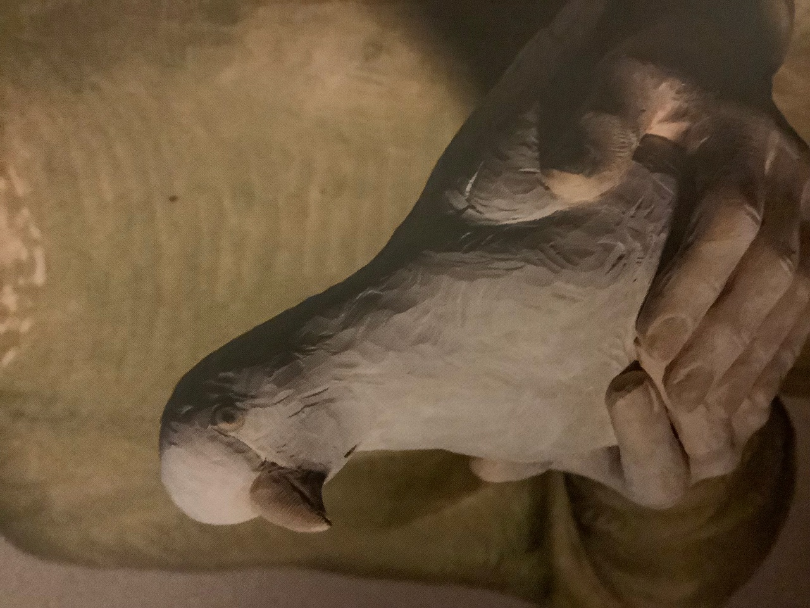

„ER ist unser Friede“, schreibt der zu Jesus umgekehrte Jude Saulus aus Tarsus in seinem Brief an die Christengemeinde in Ephesus (Eph 2, 14). Und er meint damit natürlich ihn, den Juden Jesus aus Nazareth, den er als den verheißenen Messias ansieht. In vielen theologischen Ausführungen klärt er in seinen Briefen die Messianität Jesu, die er bis zu seinem Bekehrungserlebnis vor Damaskus vehement abgelehnt und bekämpft hatte.\
Er hat erkannt und bekennt seither mit leidenschaftlichem Eifer: Jesus IST „der, der da kommen soll“ (Mt 11, 3), und er bringt denen den Frieden, den Schalom, die auf ihn vertrauen.\
Und er bringt uns nicht nur Frieden, sondern IST Frieden, weil er den Dualismus beendet und das Getrennte eint: „ipse est enim pax nostra qui fecit utraque unum“ – weil er in seiner Person aus beiden, Juden und Nichtjuden, das EINE Gottesvolk macht, die in **יהוה** ICHBINDABEIEUCH geeinte Menschheit.

Wenn wir als Menschheit EINS sein wollen, brauchen wir ein Integral, das uns in sich vereint. Es kann nur **יהוה**-liebevoll-allgegenwärtig-seiend sein, aller liebende Präsenz!

Ehre sei **יהוה** in der Höhe und in der Tiefe, in der Breite und in der Länge! Friede den Menschen, die das Gute wollen und es auch tun!

(Der Südtiroler Bildhauer Bruno Walpoth hat für die Klosterkirche in Gerleve eine Statue des heiligen Josef geschaffen. Der Fotograf Jörg Schellschmidt hat sie - und eben auch die Hände mit der Taube - für den Bildband „Immer jung“ der Benefiktinerabtei Gerleve fotografiert.)
