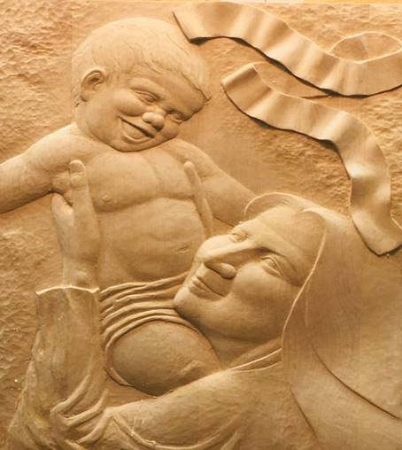

München, in der Weihnachtsoktav 2021  
(„Wer kommt in der Oktav, ist auch noch brav!“ - 
so habe ich es von den K‘s gelernt…)   
Liebe Leserinnen und Leser!

In diesem zweiten coronarischen Jahr ist in meinem eremitischen Leben eine schöne „Frucht“ herangewachsen: das oben dargestellte Holzrelief einer Frau, die ein herzhaft lachendes Kind hochhält und es dabei freundlich anlächelt.

Das Relief aus Ahornholz ist das Ergebnis eines längeren Austauschs zwischen mir und Shigeyuki Miyagawa, den ich zusammen mit meiner Freundin G. an der hiesigen Meisterschule für das Holzbildhauerhandwerk kennen- und schätzen gelernt habe.\
Ich wollte eine ikonographisch eher ungewöhnliche Mutter mit Kind. Der Wunsch war durch die Nachbildung der „Madre del Buon Consiglio“ von Genazzano entstanden, die J. K. für meine jetzige Pfarrkirche geschaffen hatte.\
Als Shige Anfang dieses Jahres wieder aus Japan zurückkehrte, hatte er schon ein paar Entwürfe dabei. Nach mehreren Gesprächen und Überlegungen fand ich die obige Darstellung am überzeugendsten. Shige machte sich ans Werk, und am Gedenktag der Namen Mariens, am 12. September, konnten wir die „Mutter mit dem lachenden Kind“ im Rahmen einer schönen Zusammenkunft im Park enthüllen und bewundern.

Nur das Spruchband war noch unbeschriftet. Wir beratschlagten und fanden viele passende Worte; mein „Mönchsbruder“ Anianus alias H.Ch. legte mit „Laetitia“ die Spur jetzt gerade in Arbeit befindlichen Inschrift. Sie wird „Laetare Alleluja“ lauten - ein Zitat aus der österlichen Marienantiphon.

Ich habe lange „in meinem Herzen bewegt“, ob überhaupt und wenn ja, welche Worte da zu lesen sein sollen. Wenn unbeschriftet, hätte immerhin jede/r Betrachter/in die Möglichkeit und wäre auch herausgefordert, eine persönliche Inschrift zu finden…

„Laetare Alleluja“ bringt für mich die urmenschlich-mütterliche Freude zum Ausdruck, die wohl jede Frau und hoffentlich auch jeden Mann erfüllt, wenn sie ein vor Vergnügen juchzendes Kind tragen und in die Höhe heben. Zugleich weisen mich die beiden Worte auf die Beglückung der Maria hin, die das Jesuskind trägt und hält, das fleischgewordene „Wort“ **יהוה** - ICHBINDABEIEUCH.

Jeden Tag habe ich seit jenem Septembertag vor dem Bildnis der Mutter mit dem lachenden Kind das „Regina Coeli“ gesungen und am Schluss gebetet: „Du Madonna mit dem lachenden Kind, hilf, dass wir bei Troste sind!“

Ich bin zutiefst davon überzeugt, dass wir in Zeiten wie diesen die Tröstungen des Pneuma tou Theou (des Hl. Geistes) mehr brauchen als alles andere - selbst als die Gesundheit, die einem ständig mit der albern-hysterischen Aufforderung „Bleiben Sie gesund!“ als das allerwichtigste Gut nahegelegt wird.\
Hoffentlich bleiben wir mehr als vor Covid davor bewahrt, in all der aktuellen Überforderung unserer seelisch-geistigen Kräfte den Verstand, die Hoffnung, die Geduld, das Vertrauen, die Mitmenschlichkeit und die Liebe – eben den TROST zu verlieren, unsere heilige Geistesgabe!

Am Samstag vor Weihnachten hatte ich meinen Großneffen und seine Freundin zu einem vorweihnachtlichen Abendessen eingeladen. M. betreut meinen Blog. Da Shige angefragt hatte, ob er das Relief abholen könnte, lud ich ihn gleich mit zum Essen ein. Es wurde eine schöne und lebendige, interkulturelle Zusammenkunft!

Den ganzen Advent hindurch hatte mir jegliche Motivation gefehlt, mein Zuhause weihnachtlich zu schmücken und so die faktische Notlage zu übertünchen, in der wir uns alle befinden – ob gesund oder infiziert oder krank, ob geimpft, geboostert oder ungeimpft!

Mir war nach radikaler Nüchternheit und Verinnerlichung zumute! Keine Zweige, keine Kugeln, keine Kerzen, keine Sterne, kein Weihnachtsoratorium, keine Wohligkeit, keine Verzauberung, keine Illusionen, während draußen der Krieg gegen das Virus in den Köpfen der Menschen tobt!\
Nur noch der nackte Glaube sollte Raum finden, das Vertrauen in die unverzierte Gegenwart des g’ttlichen Geliebten!

Da brachte mir Shige einen kleinen Christbaum als Geschenk mit - einen vierstöckig geschnitzten und mit japanischem Sumachbaumharz lackierten Tannenbaum! In seiner Spitze steckt ein Silberdraht, an dessen Ende eine silberne Sternenkugel mit unterschiedlich langen Strahlen befestigt ist! Obwohl sie auch an das C-Virus erinnert, war ich begeistert: „Ich hab einen Christbaum bekommen!“

Ohne Shige’s Baum hätte es heuer in meinem Zuhause außer der vielen geschenkten Weihnachtsbäckerei keine äußeren Zeichen von Weihnachten gegeben!

In meinem Bethlehem auf der orientalischen Messingtischplatte stehen nun unter dem „Sternenbaum“ die peruanischen Krippenfiguren: Maria, Josef, das Kind in seiner Krippe, Ochs, Esel und drei Hirten, die sich bei Bedarf auch in Sterndeuter verwandeln können. Kurze Christbaumkerzen am Rand der Platte umrunden die „Installation“. That’s all. Kein Heu, kein Stroh, keine Engel. Kriegsweihnacht 2021.

Meinem evangelischen Pfarrer-Kollegen F. hatte ich zugesagt, seine Christmette in einer Kirche im Süden von München mitzufeiern. Unterwegs dorthin half mir eine dienstmüde Altenpflegerin dankenswerterweise mit einer neuen FFP2-Maske aus der Bredouille! Ich hatte die meine vergessen, war einstweilen unmaskiert gefahren und sprach die gute Frau deshalb an der Trambahnhaltestelle an.

Gefreut hat mich im Gottesdienst die Auslegung des „Adeste fideles“ als Einladung, einfach DA ZU SEIN VOR SEINEM GOTT – so zumindest habe ich sie verstanden!\
Aufregend und unheimlich zugleich war die mir von einem Gottesdienstbesucher angebotene nachmitternächtliche Heimfahrt in einem geradezu futuristisch ausgestatteten Elektro-SUV…

Zuhause angekommen zündete ich dann noch die Kerzen an, setzte mich vor die Krippe und war einfach nur DA, zusammen mit den anderen, unter dem Stern von Bethlehem.

So vieles bewegt mich am Ende dieses Jahres, Trauriges und Erfreuliches, unfassbar Erschreckendes und traumhaft Schönes. Ich könnte viele Seiten damit füllen, will es aber lieber hier gut sein lassen.

Für Euer/ Ihr bisheriges Interesse an diesem Blog sage ich herzlich: DANKE!

Möge, was Ihr teilt, sich stets für Euch mehren!

Ihr seid mir jeden Tag gegenwärtig, wenn ich im „Präsenzdienst“ vor **יהוה**, meinem Gott, bin. Und in diesem GewärtigSein nehme ich Euch von Herzen gerne mit ins Neue Jahr und bewahre Euch darin.

Bleibt wohlbehütet und bei Trost, so wie ich es auch für mich erhoffe!
